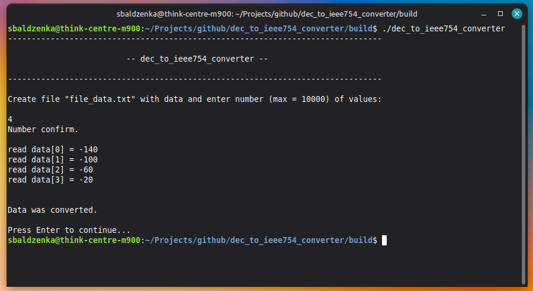
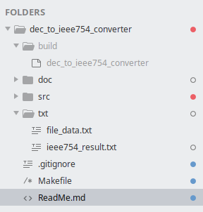
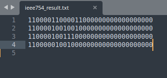

# dec_to_ieee754_converter

> **version: 1.1**

### Description:
The program is designed to convert decimal numbers to IEEE754 format numbers. Used to create FPGA BRAM initiation files.

1. Compile program using a Makefile;

2. Create a file **file_data.txt** (or change the contents of an existing file) with the numbers that need
to be converted to IEEE754 format in the **txt** directory. **The numbers in the created file should be described in a column, without commas**;

#### Example:

			-14.7
			0.78
			140

3. Open **build** folder and run **dec_to_ieee754_converter**;

4. The converted values from the file will be saved in the **ieee754_result.txt** file in 32-bit binary form.
There is no need to create the **ieee754_result.txt** file. When converting again, delete the old **ieee754_result.txt** file,
otherwise new values will be added to the file with the old values.

